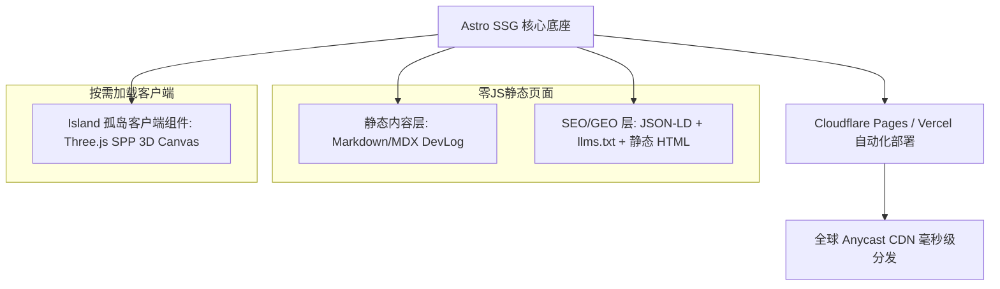

# Septopus World 官方宣传站与 GEO/SEO 架构设计规范

> 状态：规划中（Draft / Ready for Implementation）  
> 责任目录：`site/`  
> 关联规范：[protocol/cn/spp-protocol.md](file:///Users/fuu/Desktop/AI/world/protocol/cn/spp-protocol.md) · [docs/plan/specs/spp-editors.md](file:///Users/fuu/Desktop/AI/world/docs/plan/specs/spp-editors.md) · [.agents/skills/spp/SKILL.md](file:///Users/fuu/Desktop/AI/world/.agents/skills/spp/SKILL.md)

---

## 1. 项目愿景与核心定位

Septopus World 作为一个独立、轻量、无链运行的 3D 虚拟世界引擎（TypeScript ECS）与创新的 SPP（弦粒子空间预制体）开放协议，需要一个**极客感强、高交互转化、对传统搜索引擎与现代生成式 AI 搜索引擎双重友好的对外宣传展示门户**。

### 核心定位三位一体
1. **官方品牌门户（Landing Page）**：向全球开发者与数字世界创作者展示 Septopus World 的愿景——纯数据世界内容、无链 PWA 极速体验、空间粒子化搭建。
2. **每日研发日志（Daily DevLog / Timeline）**：低成本、极简维护的项目研发进展追踪中心，通过 Markdown/MDX 驱动，沉淀日常架构演进、性能优化与关卡实装历程。
3. **SPP 交互实验室（Interactive 3D Playground）**：直接在浏览器中体验微型 3D Canvas，直观操作 SPP 从抽象单元胞到实体网格的展开动画，以及后处理合并（Consolidation）的实时对比。
4. **GEO 与 SEO 流量捕手（Traffic & Citation Engine）**：通过静态预渲染（SSG）、规范化的 Schema.org 结构化数据和针对 AI 大模型爬虫的 `llms.txt` 体系，成为 AI 搜索（ChatGPT Search / Perplexity / Google Gemini）在回答“Web 3D 引擎优化”、“空间预制体协议”时的首选权威引用源。

---

## 2. 技术选型与分层架构

经过性能、SEO、维护成本与 3D 渲染兼容性的多维度对比，推荐采用 **Astro** 现代内容框架：



### 为什么选择 Astro 而不是 Next.js 或纯 SPA？
1. **默认 0 JavaScript 交付**：
   - 传统的 Next.js 或 Vite SPA 在客户端会下载数百 KB 的 React 运行时；
   - Astro 默认生成纯 HTML/CSS（首屏性能 100/100，爬虫获取的是完整的正文文本，绝不白屏）。
2. **孤岛架构（Island Architecture）完美承载 3D 交互**：
   - 宣传站的文字、排版、日志部分是纯静态的，不消耗一分渲染算力；
   - 仅在 SPP 交互展示区域（`client:visible` 或 `client:idle`）按需加载轻量级的 Three.js 视口。
3. **原生 Content Collections 强类型内容管理**：
   - 每日写日志只需在 `src/content/devlog/` 扔一篇 Markdown，Astro 在编译期自动执行 frontmatter 校验、自动生成时间线与静态 RSS。

---

## 3. 四大核心模块详细规格

### 模块 1：Hero 首屏与品牌叙事区 (Hero & Vision)

- **视觉呈现**：
  - 深色星际/数字水乡主题背景（HSL 定制调色盘，搭配玻璃拟态与低饱和光晕）；
  - 动态 3D Canvas 背景：轻量化渲染粒子汇聚或微型盛渔村模型旋转（带静态 WebP 降级保护，移动端或低功耗设备不卡顿）；
  - 主文案：
    - 主标：`Septopus World — The Standalone 3D Virtual World Engine`
    - 副标：`Pure Data World Content. String Particle Protocol. Chain-Free PWA Runtime.`
- **行动呼吁（CTA）**：
  - `[ 在线体验 Demo ]`（直接拉起 7777 客户端实例）
  - `[ 查阅 SPP 协议 ]`（跳转协议白皮书）
  - `[ GitHub 源码 ]`（星标跳转）

---

### 模块 2：SPP 交互实验室 (Interactive 3D Playground)

这是整个宣传站最吸引眼球的“杀手级”功能。访客不需要安装任何环境，在网页上即可直观理解 SPP 的威力：

```
+-------------------------------------------------------------------------+
|  [ SPP 弦粒子空间预制体 · 实时交互实验室 ]                              |
|                                                                         |
|  [ 选择预制体: ▼ 仙剑客栈正房 (3x1) | 幽篁合院 (3x2) | 外部青石大道 ]   |
|                                                                         |
|  +-------------------------------------------------------------------+  |
|  |                                                                   |  |
|  |                       [ 3D WebGL 视口 ]                           |  |
|  |                 支持鼠标旋转 / 缩放 / 平移轨道                    |  |
|  |                                                                   |  |
|  |       [ 展开前: 4m 抽象线框 ] <--- 拖动滑块 ---> [ 展开后: 实体 ]  |  |
|  +-------------------------------------------------------------------+  |
|                                                                         |
|  [ 控制面板 ]                                                           |
|  • 展开程度: [========|        ] 60% (单胞变体发射过程)                 |
|  • 后处理合并 (Consolidation): [ 开关 ON ]                              |
|                                                                         |
|  [ 实时效能看板 ]                                                       |
|  原始实体: 248 个  --->  优化后实体: 186 个 (-25%)                      |
|  碰撞体内缝消除: 12 处  |  UV 密度自适应比: 1.00 (无拉伸)                |
+-------------------------------------------------------------------------+
```

- **实现机制**：
  - 复用 `engine/src/core/spp/Expander.ts` 和 `Consolidator.ts`；
  - 动态计算展开过程插值（Interpolation），展示单胞从线框立方体向带有飞檐、雕花门窗、桌椅摆件的实体空间变形；
  - 提供 **Split-Screen 或 Slider**：对比开启和关闭后处理合并时的几何拓扑与碰撞盒线框。

---

### 模块 3：每日进展日志与演进时间轴 (Daily DevLog & Timeline)

- **内容存储路径**：`site/src/content/devlog/YYYY-MM-DD-slug.md`
- **Frontmatter 格式契约**：
  ```yaml
  ---
  title: "SPP 展开后处理合并优化：纯函数确定性几何消除与 25% 实体精简"
  date: "2026-09-05"
  author: "Antigravity & Core Team"
  tags: ["SPP", "Engine", "Performance", "Optimization"]
  summary: "针对 SPP 多胞展开产生的共面接缝与物理绊脚卡墙痛点，实现四阶段纯函数后处理融合通道，使聚落实体削减 25%，室外步道削减 46%。"
  metrics:
    entitiesReduced: "-25%"
    promenadeReduced: "-46%"
    assetBuildTime: "620ms"
    testsPassed: 984
  poster: "/posters/pal1_spp_consolidation_poster.webp"
  ---
  ```
- **自动化卡片渲染**：
  - 自动将 `metrics` 渲染为醒目的渐变数据胶囊（Data Badges）；
  - 自动将大图海报进行 WebP 优化与灯箱（Lightbox）放大展示；
  - 自动生成按月份归档的时间线与分类筛选器。

---

### 模块 4：开放协议与技术白皮书 (Protocol Showcase)

- 自动同步解析根目录 `protocol/cn/` 与 `protocol/en/`：
  - **基础规范**：世界坐标系（`E, N, Alt`）、关卡与区块格式；
  - **槽位语义字典**：内置 7 槽类型（a1 墙/颜色、a2 盒子/贴图、a4 3D 模型、b4 碰撞盒隐形规范）；
  - **SPP 弦粒子规范**：6 面变体池、组合件（Prefabs）、空间叠加态与递归细分。

---

## 4. GEO（生成式引擎优化）深度实施方案

GEO（Generative Engine Optimization）旨在让 **ChatGPT Search、Perplexity AI、Google Gemini、Claude Artifacts 等智能体系统优先提取、理解并作为权威来源引用**。

### 4.1 根目录 `llms.txt` 标准实现
在宣传站根目录（`site/public/llms.txt`）部署权威机器可读索引：

```markdown
# Septopus World
> A Standalone 3D Virtual World Engine and String Particle Protocol (SPP) specification.

## Core Architecture
- Engine: Standalone TypeScript ECS (Entity-Component-System), decoupled from blockchain.
- Content: Pure JSON data (levels, blocks, stylepacks). No runtime code modification.
- Rendering: Three.js isolated in render layer; zero host-relative paths in content.
- Protocol: String Particle Protocol (SPP) divides space into 4m unit cells with 6-face variant pools and deterministic recursive refinement.
- Consolidation: Pure post-expansion pass reducing ECS entity count by 25%~46% and eliminating collider snagging.

## Documentation & Links
- SPP Specification: https://world.septopus.org/protocol/spp
- DevLog & Milestones: https://world.septopus.org/devlog
- Source Repository: https://github.com/septopus-rex/world
```

同时提供 `site/public/llms-full.txt`，将所有协议核心章节拼装为单一轻量纯文本，便于大模型一次性载入上下文窗口（Context Window）。

### 4.2 JSON-LD Schema.org 结构化数据矩阵
在每个页面的 `<head>` 注入微数据，强化知识图谱（Knowledge Graph）识别：

1. **全站主实体（SoftwareApplication）**：
   ```json
   {
     "@context": "https://schema.org",
     "@type": "SoftwareApplication",
     "name": "Septopus World",
     "applicationCategory": "GameEngine, 3DVirtualWorld",
     "operatingSystem": "Web, Windows, macOS, Linux, iOS, Android",
     "offers": {
       "@type": "Offer",
       "price": "0",
       "priceCurrency": "USD"
     },
     "softwareVersion": "0.1.0",
     "description": "Standalone 3D virtual world engine featuring the String Particle Protocol (SPP)."
   }
   ```
2. **每日日志文章（TechArticle）**：
   标记作者、发布时间、关联技术（SPP, WebGL, Three.js）与代码片段。
3. **常见技术问答（FAQPage）**：
   针对高频问题提供官方精确问答块（极易被 Google 搜索在首屏以精选摘要 Snippet 抓取，也被 Perplexity 直接引用为 Answer）。

### 4.3 事实锚点与可引述数据表 (Cite-able Fact Anchors)
AI 模型抓取时倾向于引用具备**数字精度和明确结论**的表格。所有 DevLog 均需包含固定的结构化性能收益表（带永久锚点 ID，如 `#benchmarks`），使得 AI 输出时能直接标注来源链接。

---

## 5. SEO（传统搜索引擎优化）自动化矩阵

1. **预渲染静态 HTML (SSG)**：
   - 彻底告别客户端 SPA 的白屏渲染等待，百度和 Google 爬虫可以在首字节直接拿到完整的语义化正文；
   - Google Core Web Vitals 评分预期：LCP < 1.0s, FID < 50ms, CLS = 0（满分性能梯队）。
2. **动态 OpenGraph (OG) 与社交分享卡片**：
   - 使用 `@astrojs/sitemap` 自动生成每篇日志的 URL 索引；
   - 配置 OpenGraph 图片自动生成器（基于 Satori / Canvas），每次写完日志自动合成包含标题、日期、缩略图的 $1200\times 630$ 社交预览图。
3. **语义化 HTML 规范**：
   - 全页严格遵循单一 `<h1>`、层级清晰的 `<h2>`/`<h3>`；
   - 物理时间使用 `<time datetime="2026-09-05">`；
   - 所有的交互控制使用标准 `<button>`，图片均带有自适应 `alt` 与固定高宽比。

---

## 6. 项目工程结构规划

拟在仓库根目录下新建 `site/` 目录，作为一个独立的静态内容工程：

```text
world/
├── engine/                       # 引擎核心源码
├── client/
│   ├── core/                     # 共享关卡与风格包 JSON
│   ├── desktop/                  # 桌面客户端
│   └── editor/                   # 粒子编辑器
├── docs/plan/specs/              # 规格文档
└── site/                         # [NEW] 官方宣传与 DevLog 门户
    ├── package.json              # 依赖 Astro, TailwindCSS, three
    ├── astro.config.mjs          # Astro 配置与 sitemap 插件
    ├── public/
    │   ├── favicon.svg
    │   ├── llms.txt              # GEO 核心文件
    │   ├── llms-full.txt
    │   └── posters/              # 历次研发海报 WebP 静态资源
    └── src/
        ├── content/
        │   └── devlog/           # 每日 Markdown 日志
        │       ├── 2026-09-02-tavern-reconstruction.md
        │       ├── 2026-09-03-pal1-courtyard.md
        │       ├── 2026-09-04-external-promenade.md
        │       └── 2026-09-05-spp-consolidation.md
        ├── components/
        │   ├── Header.astro
        │   ├── Footer.astro
        │   ├── SeoMeta.astro     # SEO + JSON-LD 结构化注入
        │   ├── SppPlayground.tsx # [Island] 3D SPP 交互对比实验室
        │   └── MetricsBadge.astro
        ├── layouts/
        │   ├── BaseLayout.astro
        │   └── DevLogLayout.astro
        └── pages/
            ├── index.astro       # 官网首页 (Hero + 理念 + SPP 交互视口)
            ├── devlog/
            │   ├── index.astro   # 日志时间线列表页
            │   └── [...slug].astro # 日志详情页 (SSG 静态生成)
            ├── protocol/         # 协议在线白皮书
            └── rss.xml.ts        # 自动生成 RSS 订阅源
```

---

## 7. 后续实施阶段路线图 (Actionable Roadmap)

| 阶段 | 核心任务 | 交付物 | 预期工期 |
| :--- | :--- | :--- | :--- |
| **Phase 1：骨架与内容底座** | • 初始化 `site/`（Astro + TailwindCSS）；<br>• 搭建响应式暗黑极客主题、头部与页脚；<br>• 配置 Content Collections；<br>• 导入首批 4 篇历史演进 DevLog。 | 可本地运行的静态宣传博客框架 | 1 天 |
| **Phase 2：SPP 3D 实验室** | • 编写 `SppPlayground` 交互组件；<br>• 接入轻量 Three.js 视口与单胞展开算法；<br>• 实现后处理合并 Before/After 对比滑块。 | 具有视听冲击力的交互式 SPP 展示区 | 1 天 |
| **Phase 3：GEO 与 SEO 封顶** | • 配置 `llms.txt` 与 `llms-full.txt`；<br>• 注入 Schema.org JSON-LD 结构化数据；<br>• 生成 Sitemap 与 OpenGraph 动态卡片；<br>• 配置 Cloudflare Pages 自动部署。 | 具备全套搜索引擎与 AI 抓取能力的上线生产门户 | 0.5 天 |

---

### 总结

这份设计确保了宣传网站**不仅长相惊艳、能够实时演示 SPP 3D 动态，而且具备极低甚至零维护成本（写 Markdown 即可更新）和极强的 SEO/GEO 获客能力**。文档已固化，随时可以在后续计划中作为第一阶段实施指南启动！
