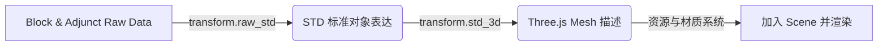

# 渲染系统与 Three.js 集成 (Render Pipeline)

考虑到引擎可以跨端运行的基础设定，Septopus 核心包 (Core) 的数据处理管线与视觉渲染管线 (Render Pipeline) 是高度解耦的。当前官方默认提供基于 Three.js 为底层的 3D/2D 渲染系统。

## 1. 渲染器种类 (Render Types)

根据使用场景，引擎运行时可挂载不同模式的渲染出口：
*   **3D渲染器 (FPV 视角)**：负责呈现第一人称/第三人称沉浸式漫游（`render/render_3d.js`）。这也是最吃性能的核心渲染管线。
*   **观察渲染器 (Observe Mode)**：上帝视角漫游，不挂载主角摄像机，常作为场景编辑器底座 (`render/render_observe.js`)。
*   **2D小地图渲染器**：基于 Canvas API，不加载材质和立体模型，纯二维几何图形绘制地图路况 (`render/render_2d.js`)。
*   **单体模型渲染器**：在游戏内呼出物品栏 3D 预览时，单独起一个沙盒负责模型和骨骼的检视。

*注：除了 2D 渲染器，其余渲染模式底层均封装了 Three.js 的 `WebGLRenderer`。*

## 2. 场景组装管线 (Scene Assembly Pipeline)

引擎将区块链上读取到的 Raw 格式数据解包至渲染流水线，主要流经三个清洗与组装阶段：

在这套管线中，渲染器并不直接访问网络：
1. **材质探查**：遍历区域内所有即将被实例化的描述符，抽出当中需要的贴图（Texture ID）和外部模型文件（glTF/fbx Hash）。
2. **异步依赖拉取**：唤起资源管理器（Resource System），在主线程并行下载上述材质与模型文件并在内存中转为供 WebGL 消费的多纹理对象（Multi-Materials）或占位符框。
3. **坐标系换算**：由于[Septopus有着特立独行的左手系坐标](./coordinate.md)，引擎会将所有内部推算的物理坐标转换至 Three.js 的内部系统：
   `Three(x, y, z) = Septopus(x, z, -y)`
4. **注入剔除队列**：将最终生成的 Mesh 加入 `scene.children` 并在离开视窗一定距离后自动 `dispose()` 释放 GPU 内存。

## 3. 编辑态与线框叠加 (Editor Overlay)

相比纯浏览态，Edit Mode（编辑模式）在底层具有更高的刷新频率且需要在 `Scene` 里重叠第二套特殊元素库。
1. **高亮边缘线 (Edge Helpers)**：在 Mesh 周边套上一层 `LineSegments` 高亮网格提示边界。
2. **标尺地网 (Grid Line)**：实时生成无碰撞体积的三维动态基准面供鼠标参考。
3. **Ghost Stop 阴影**：将被隐藏或是透明的触发器（Trigger）与空气墙（Stop）转换成半透明有色方块显示，避免“隐形物”无法被肉眼选中的尴尬问题。
