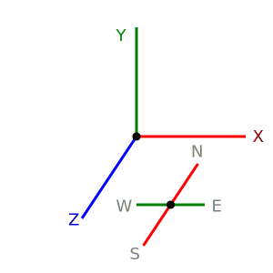

# Septopus World引擎说明

## 基础说明

* `Septopus坐标系`如下图所示，XY轴为`地块`的方向，Z轴为`玩家`站立的方向。不同于`three.js`的默认坐标系。

|  Septopus坐标   | Three.js坐标  |
|  ----  | ----  |
|   |  |

* `Septopus`提供单一程序，支持以下运行模式，用于不同的用途。

|  模式   | 主要作用  | 实现方式 |
|  ----  | ----  | ----  |
| 正常浏览  | 注册用户的模式，可以使用`形象`，能触发`机关` | ----  |
| 鬼魂模式  | 非注册用户的模式，可以游荡，但不能互动 | ----  |
| 编辑模式  | 对`地块`数据进行编辑的模式，只能对单一地块进行编辑 |  独立出编辑部分的数据，单独处理 |
| 游戏模式  | 进入游戏的模式，只触发游戏涉及的`地块`内的`机关`，预渲染所有涉及的地块 | 使用`现场恢复`的方式,游戏的输出结果需要预定义 |

* `Septopus`保存在链上的数据类型如下，以`Solana`为例。

|  数据名称   | 主要作用  | 保存位置  |
|  ----  | ----  | ----  |
|  地块数据  | 构建地块显示内容的数据 |  独立PDA账号  |
|  世界数据  | 配置单个世界的基本属性  |  独立PDA账号  |
|  通用配置  | 所有世界通用的基本属性 | 独立PDA账号，初始化时设置  |
|  Septopus引擎  |  用于运行世界的Javascript程序 |  独立PDA账号，附属物独立的PDA账号 |

* `Septopus`数据结构设计部分，采用多种`中间态标准`,例如组件数据、输入组件等。这样可以适应不同的网络存储及不同的渲染前端，提高引擎的兼容性。通过`简记符`来标识数据间的转换，例如，附属物里的`raw_std`方法，是将数据源`原始数据`转换成运行时里的`标准数据`。

|  数据名称   | 主要作用  | 保存位置  | 简记符  |
|  ----  | ----  | ----  | ----  |
| 原始数据  | 精简的压缩数据，由纯数字构成 | 链上，由`数据源(datasource)`提供  | `raw` |
| 标准数据  | 由`原始数据`根据定义转换来的，作为转换成其他数据的基础 | 运行时  | `std` |
| 渲染数据  | 由`标准数据`转换的，应用于显示渲染的数据 | 运行时  | `3d`,`active` |
| UI数据  | 供UI系统生成用户操作的数据 |  附属物组件  | - |

* `Septopus`采用地块来优化数据结构，存在`地块坐标(A坐标系)`和`世界坐标(B坐标系)`，在渲染器结果里又存在`屏幕坐标(C坐标系)`，这3者之间的转换是比较复杂的问题。

|  坐标系名称   | 主要作用  |  简记符  |
|  ----  | ----  | ----  |
|  地块坐标  | 压缩数据，便于理解；便于拷贝，重复使用；| `A`  |
|  世界坐标  | 拼接地块数据；实现动态加载； | `B` |
|  屏幕坐标  | 用于显示；接受屏幕的输入； | `C` |

* `Septopus`深度利用区块链的特性，根据区块高度来计算Septopus的独立`时间`，根据区块哈希来调整Septopus的`天气状态`。从而让数据具有可呈现的时间属性。未来，对3D物体，还可以根据时间进行显旧处理。或者，`天空`根据`时间`和`天气`来显示，和区块链数据实现深度绑定

|  特性名称   | 主要作用  |  区块链部分  | 适用范围  |
|  ----  | ----  | ----  | ----  |
| 时间  | Septopus的时间体系，由`通用配置`定义 | 区块高度  | 玩家（年纪等）；附属物（自然生长等）； |
| 天气  | Septopus的天气体系，由`通用配置`定义 | 区块哈希  | 玩家（运动能力等）；附属物（渲染效果等）； |

* `Septopus`支持多种区块链网络，合约部分依靠外部引入进行支持，不受网络限制。初期版本部署在Solana网络，依赖其便利的链上数据存储和高速响应。

* 采用`单例模式`进行开发，适用于单一视口渲染，更符合Septopus World的应用场景，有利于优化性能。带来的问题是在多窗口显示Septopus内容时，开发复杂度较高。

## 程序结构

* `Septopus引擎`，主要由以下几个部分构成。各部分功能独立，是一种松耦合的状态。主要的功能扩展来自于`附属物`,框架设计目的是为减少其代码量，提升其可理解性。

|  组成部分   | 主要作用  | 文件位置  |
|  ----  | ----  | ----  |
| **附属物**  | 3D/2D数据构建；数据编辑功能；IO的UI输出； | `./adjunct/` |
| 框架部分  | `地块`数据管理；`世界`数据管理；引擎组件组织和管理； |  `./core/framework.js` |
| 基础功能  | 世界启动及管理；时间控制；气候控制；天空管理；玩家控制；玩家管理； |  `./core/` |
| 渲染器  | 3D渲染；2D渲染 |  `./render/` |
| 控制器  | 3D控制(手机端，PC端)；2D控制(手机端，PC端) | `./control/` |
| 输入输出  | 基础UI；区块链网络连接； | `./io/` |
| 输入输出  | 通用功能库；数据转换功能； | `./lib/`,`./three/` |
| 插件  | 扩展功能； |`./plugin/` |

* 由于涉及存在性能瓶颈的3D运算，`Septopus引擎`使用帧同步计算方式，将需要处理的数据和功能，和帧更新同步，减少等待的卡顿，保障3D运行的流畅。例如，需要网络加载资源时，会保持数据，每帧进行一次网络请求。数据请求成功，也是在每帧处理一个资源的解析。

### 附属物

* 普通`附属物`实现的功能如下，详细说明: [附属物详细说明](./adjunct.md)

|  功能划分   | 功能说明  | 挂载位置  |
|  ----  | ----  | ----  |
| 钩子 |  注册组件；动画入口； | `ADJUNCT.hook` |
| 定义及常量 |  组件的配置；组件的常量； |  |
| 动画实现 | 独立定义的动画方式；动画的数据处理； | `ADJUNCT.hook.animate()` |
| 数据转换 | 不同标准数据的转换； | `ADJUNCT.transform` |
| 数据增删改查 | 对`raw`数据进行的修改； | `ADJUNCT.attribute` |
| IO菜单 |  输出标准的IO菜单；输入数据验证； |  `ADJUNCT.menu`|

### 框架部分

* 框架部分，解决了数据整合，代码管理等诸多功能。

|  主要功能   | 补充说明  | 文件位置  |
|  ----  | ----  | ----  |
| 世界运行入口 | 启动Septopus的位置 | `core/world.js` --> `VBW.world.first()` |
| 组件注册功能 | 挂载组件的注册信息；挂载组件的方法到`VBW`根；初始化`cache`数据; | `core/framework.js` --> `VBW.component` |
| 帧同步实现 |  运行帧同步队列里的方法；更新渲染器； | `core/framework.js` --> `VBW.loop()` |
| 全局数据 |  链式访问的全局数据； | `core/framework.js` --> `VBW.cache` |
| 模式切换 | 不同模式下的数据调整；  | `core/framework.js` --> `VBW.mode()` |
| 数据更新 | 外部获取数据的组件；根据组件类型`datasource`来挂载； | `core/framework.js` --> `VBW.datasource` |
| 配置管理 |  所有组件配置的读和挂载；定义常量的读和挂载 | `core/framework.js` --> `VBW.setting` |
| 运行环境检测 | 运行设备检测；Node属性检测； | `core/detect.js` |
| 地块解析 |  数据转换及更新；编辑菜单输出； | `core/block.js` |
| 事件管理 |  自定义事件；事件的绑定和解绑； | `core/event.js` |
| 运动控制 |  物体基本运动实现；视角变换的实现；  | `core/movement.js` |
| 玩家管理 |  运行状态保存；虚拟形象管理； | `core/player.js` |
| 内部时间计算 |  根据区块高度来计算Septopus时间； | `core/time.js` |
| 天气状态计算 |  根据区块哈希来计算Septopus天气特征； | `core/weather.js` |

### 渲染器

|  渲染器名称   | 主要功能  | 文件位置  | 挂载位置  |
|  ----  | ----  | ----  | ----  |
|  3D渲染器  |  整体场景渲染；地块动态加载； | `render/render_3d.js`  |  `VBW.rd_three`  |
|  2D渲染器  | 小地图功能实现；多维视图实现；  | `render/render_2d.js`  |  `VBW.rd_two`  |
|  2D渲染器  | 独立组件查看；独立地块查看；  | `render/render_observe.js`  |  `VBW.rd_observe`  |

### 控制器

|  控制名称   | 主要功能  | 文件位置  | 挂载位置  |
|  ----  | ----  | ----  | ----  |
|  3D第一人称控制  |  运动控制；键盘控制实现；屏幕触控操作实现； | `control/control_fpv.js`  |  `VBW.con_first`  |
|  2D地图控制  |  按钮操控实现；屏幕操控实现；不同精度输出； | `control/control_2d.js`  |  `VBW.con_two`  |
|  3D观察者模式控制  |  3D物体观察实现；屏幕控制实现 | `control/control_observe.js`  |  `VBW.con_observe`  |

### 输入输出

|  类别   | 主要功能  | 文件位置  | 挂载位置  |
|  ----  | ----  | ----  | ----  |
|  UI框架  | 不同的输出方式实现；多种输入方式实现；UI框架复写功能；  | `io/io_ui.js`  | - |
|  API管理  | 多网络数据读取；合约请求代理；数据订阅功能实现；  | `io/api.js`  | `VBW.datasource` |

### 插件

|  插件名称   | 主要功能  | 文件位置  | 挂载位置  |
|  ----  | ----  | ----  | ----  |
|  外部链接  | 在3D里显示外部链接；二维码方式的实现；  | `io/plug_link.js`  | `VBW.plugin.link`  |
|  二维码  | 在3D里显示二维码；动画效果实现； | `io/plug_qr.js`  | `VBW.plugin.qr` |

## 执行逻辑

### 分帧处理

* 为了3D运行的流畅，系统采用`分帧处理`的方式来解决以下的异步或者大量运算的情况。

|  处理事项   | 卡顿原因  | 解决方法  |
|  加载资源  | 异步的网络处理  |  异步处理不阻断，加载成功后再继续解析  |
|  解析资源  | 模型或图片等资源解析会消耗大量资源  | 在`分帧`里逐条处理数据解析  |

* `分帧处理`的实现，是使用队列来缓存需要处理的任务，然后在挂载`帧同步`方法里逐条处理队列里的任务。如此，单帧需要处理的计算就很有限，不会出现卡顿的现象。

### 屏幕输出显示

* `标准输入格式`是传递给UI构建前端输入输出的数据格式，其格式如下：

```Javascript
    {
        type:"number",                      //输入类型
        key:"x",                            //`标准编辑格式`里的键值
        value:std.x,                        //传入的值
        label:"X",                          //显示的表情
        icon:"",                            //显示的图标
        desc:"X of wall",                   //内容说明
        valid:(val,cvt)=>{                  //参数检测函数
            return valid.x(val,cvt,std)
        }
    }
   
```

### 编辑过程

* `地块`是不同于`附属物`的数据，但其也需要在3D世界里进行显示，所有，也存在编辑的过程。但其数据格式和`附属物`进行区分，但统一处理。

```Javascript
    {
        block:[2024,501],   //需要设置的
        action:"set",       //使用的操作，["load","unload","set"]
        param:{
            elevation:2,    //需要设置的参数
        },
    }
```

* `标准编辑格式`是传输给`附属物`处理的数据标准，其格式如下。编辑参数由`附属物`产生，再交由`附属物`处理，因此除去基础的参数，就能支持`附属物`自定义的`键值`。

```Javascript
    {
        adjunct:"wall",         //附属物的名称
        action:"set",           //任务动作，["set","add","remove"]，
        x:2025,                 //区块定位x
        y:302,                  //区块定位y
        param:{                 //传递给任务的参数
            x:2,                    // STD_KEY --> Value
        },
        limit:["X","Y","Z"],    //修改中的限制
    }
```

* 当编辑过程中存在删除时，会改变`附属物`数组的拍序，从而导致编辑错误。需要对传入的操作进行排序，将删除的任务，放到最后执行。

### 动画的实现

* 系统将维持一个动画的队列，数据结构如下。将调用这个列表，来筛选并缓存的3D场景里的数据给到`附属物`去实现`effect`指定的效果。

```Javascript
    //动画队列里的数据结构
    {
        world:0,            //所属的世界
        x:203,              //地块X坐标
        y:500,              //地块Y坐标
        adjunct: "box",     //附属物名称
        index:0,            //附属物索引
        effect: 0,          //动画效果索引
        cfg:{},             //动画效果配置
    }

    //缓存的渲染对象的数据结构
    map[`${x}_${y}_${adjunct}_${index}`]=[MESH];
```

### 游戏过程
