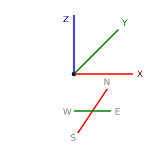

# 渲染器说明

* `渲染器`在`世界坐标(B坐标系)`上运行，即对`标准数据(std)`使用`地块定位`来拼接成完整的世界。

* `渲染器`渲染的结果为`Septopus坐标系`，如图所示

## 渲染器种类

* 根据程序需求，系统支持3种渲染器，其主要功能如下表：

|  资源类型   | 主要用途  | 代码位置  |
|  ----  | ----  | ----  |
|  3D渲染器  | 主渲染器，显示世界的3D场景  | `./render/render_3d.js`  |
|  2D渲染器 | 2D地图渲染器，显示小地图  | `./render/render_2d.js`  |
|  观察渲染器  | 显示其他3D软件生成的模型  | `./render/render_observe.js`  |
|  模型渲染器  | 预览3D模型的渲染器  | `./render/render_model.js`  |

* `模型渲染器`是为了更细致的查看模型的各项属性，测试动画等，操作逻辑和`3D渲染器`有差别，独立出来。

## 程序结构

* 使用统一的渲染入口`RENDERER.show()`,这样可以被框架直接调用。

* `渲染器`需要构建运行的Dom结构，例如，2D需要创建`<canvas></canvas>`进行绘图。

* `渲染器`可以解析`标准数据(std)`生成`渲染数据`，也可以利用其他渲染器已经解析的数据，用于输出。

## 支持的渲染器

### FPV渲染器

### 观察渲染器

* 支持多个地块的鸟瞰预览模式，支持各种特效。

### 2D渲染器

### 模型渲染器