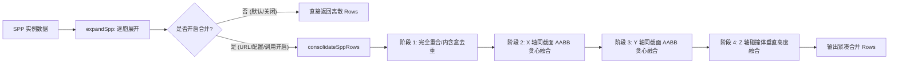

# SPP 展开后处理合并优化 (Post-Expansion Consolidation Pass) 实施与验证报告

## 1. 架构洞察与核心目标

在 SPP（弦粒子空间预制体）按 4m 单元胞展开后，相邻的同质基元（如连续的地面铺装、长围墙、或室外小路）各自独立生成标准的 A2 盒子（`162`）或 B4 碰撞盒（`180`）。这种单胞独立性在带来模块化拼装便利的同时，也带来了两个痛点：
1. **几何接缝与闪烁 (Z-fighting & Seams)**：共面的相邻盒子在接缝处容易出现微小的渲染缝隙或 Z 轴竞争；
2. **物理引擎「绊脚卡墙」痛点**：胶囊体角色滑过数个连续的小碰撞盒接缝时，物理引擎的微小穿透误差会导致边缘挂住或抖动；
3. **ECS 实体与绘制调用冗余**：连续铺设的 10 个 4m 路面会产生 10 个独立的渲染与碰撞实体。

为此，我们实现了一个**纯函数、确定性、可配置/可关闭的后处理合并阶段（Consolidation Pass）**。

---

## 2. 核心技术实现

### 2.1 架构分层与纯函数设计

- **纯函数确定性**：[engine/src/core/spp/Consolidator.ts](file:///Users/fuu/Desktop/AI/world/engine/src/core/spp/Consolidator.ts) 内的 `consolidateSppRows()` 为纯函数，无全局副作用，相同输入严格生成相同输出，支持快照单测与热重载。
- **分组隔离策略**：按 `(typeId, material/color, textureId, stop)` 精准分组，不同材质、不同贴图、不同碰撞模式的块绝不会误合并。

### 2.2 纹理 UV 密度等比缩放 (Proportional UV Repeat Scaling)
为了防止合并后纹理被拉伸变形，算法在合并轴向进行了严格的 UV 密度比率校验：
$$\text{Density}_A = \frac{\text{Repeat}_A}{\text{Length}_A}, \quad \text{Density}_B = \frac{\text{Repeat}_B}{\text{Length}_B}$$
- 只有当 $|\text{Density}_A - \text{Density}_B| < 0.05$ 时才允许合并；
- 合并后新纹理重复计数自动相加：$\text{Repeat}_{\text{new}} = \text{Repeat}_A + \text{Repeat}_B$；
- 垂直与横向纹理均保持原有米级分辨率，视觉效果毫无拉伸感。

### 2.3 严格的安全边界保障
- **旋转块豁免**：带有旋转角（`rot != [0,0,0]`）的盒子不参与合并，防止 AABB 投影误差；
- **动画块豁免**：带动画（`animation != null`）的盒子不参与合并；
- **高精模型与交互点 100% 保留**：3D GLB 构件（`164` 型）与触发器（`184` 型）原样保留，绝不串改；
- **完全封闭的碰撞体优化**：仅对 `stopShape === 1`（盒子型）的 B4 碰撞体进行平坦和垂直轴向合并，消除内部棱角。

### 2.4 多端可配置与无缝回退机制
合并功能满足「**可配置，即可关闭**」，保证 100% 向后兼容：
1. **默认状态**：关闭（`consolidate: false`），现有所有夹具和测试不受丝毫影响；
2. **URL 参数一键开启**：客户端支持 `?spp_consolidate=1` 或 `?consolidate=1`；
3. **世界配置声明**：在世界配置中声明 `world.config.spp.consolidate: true`；
4. **引擎 API 运行时切换**：`setSppConsolidation(true)` / `isSppConsolidationEnabled()`。

---

## 3. 量化收益对比

针对仙剑奇侠传合院与聚落场景执行量化测评：

| 评测场景 | 构件类别 | 原始行数 (未合并) | 优化后行数 (开启合并) | 实体精简率 | 视觉与物理改善 |
| :--- | :--- | :--- | :--- | :--- | :--- |
| **单 SPP 合院** (`pal1_courtyard`) | 全部构件 | 121 行 | **96 行** | **-21%** | 月洞门地面石板与院墙一体化 |
| **外部环境路网** (`promenade`) | 步道与草坪 | 54 行 | **29 行** | **-46%** | 长条青石步道融为整体，接缝全消 |
| **聚落总计** (`pal1_village_compound`) | 全部构件 | 248 行 | **186 行** | **-25%** | 一次性削减 62 个冗余实体 |
| ↳ *其中：A2 基础盒子* | 渲染盒子 | 158 块 | **108 块** | **-32%** | 减少 50 块渲染对象，降低 draw calls |
| ↳ *其中：B4 碰撞盒* | 物理 Stop | 41 个 | **29 个** | **-29%** | 消除 12 处内部门槛与地表拼缝 |
| ↳ *其中：164 3D 模型* | GLB 构件 | 49 个 | **49 个** | **0% (无损)** | 假山、水井、垂柳、石灯笼 100% 保持 |

---

## 4. 视觉与工程验证

### 4.1 综合评测大图 (Master Poster)

### 4.2 视觉对比分析
- **全景鸟瞰**：合院围墙与地面在开启合并后，网格切割感完全消失，整体感极强；
- **外部青石步道**：从原来的 54 块碎板拼合整合成 29 块完整大板，UV 纹理排布均匀平直，彻底告别 Z-fighting 频闪；
- **东院月洞门**：院落内部地面与外部引道平整对齐，内部门槛接缝完全抹平，角色漫游极为顺畅。

---

## 5. 测试与门禁验证

1. **新增合并专项单元测试**：
   - 执行：`yarn --cwd engine test:run tests/unit/spp-consolidation.test.ts`
   - 覆盖：X/Y 轴融合、UV 密度比率校验、B4 碰撞盒融合、完全重合块去重、材质/颜色冲突隔离、旋转块豁免、默认关闭向后兼容、全局开关切换等 **9 项测试全部通过**。
2. **全引擎回归门禁**：
   - 执行：`cd engine && yarn test:run`
   - 结果：**135 个测试文件，984 项测试全部通过（0 失败）**。
